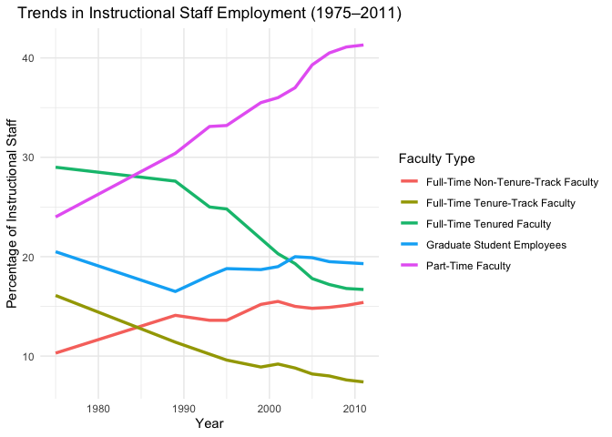
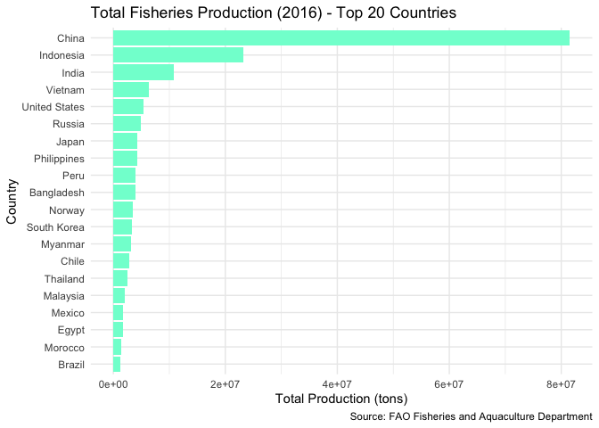
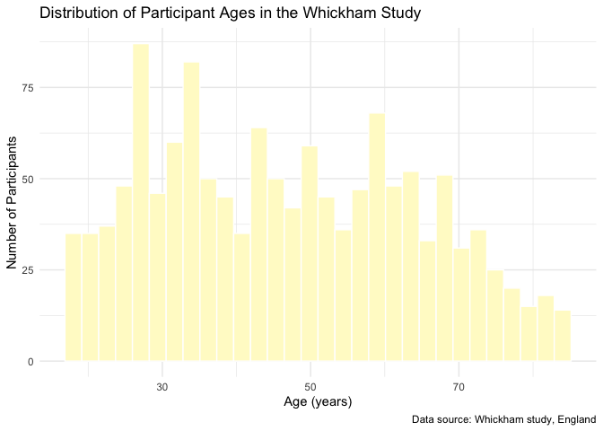
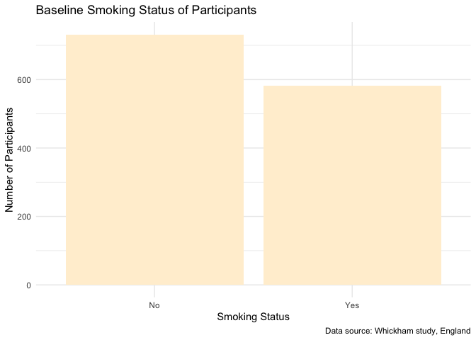
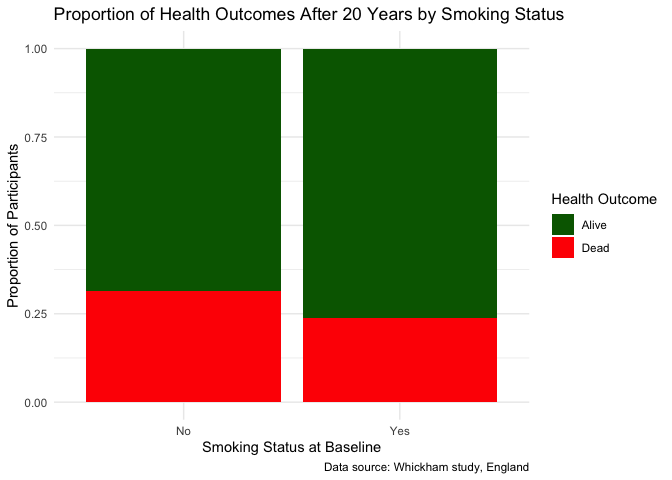
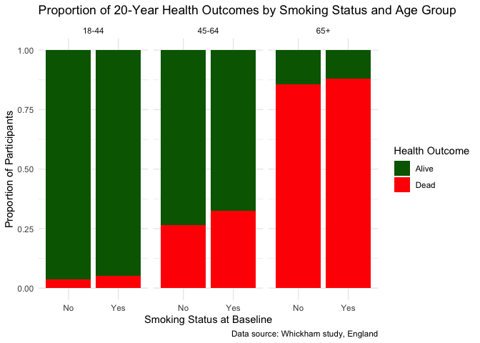

Lab 06 - Ugly charts and Simpson’s paradox
================
Verity Elliott
02_11_2026

### Load packages and data

``` r
library(tidyverse) 
library(dsbox)
library(mosaicData) 
```

### Exercise 1

## Wide to Long Transformation

The dataset contains five faculty types and eleven years of data. When
converting from wide to long format, each combination of faculty type
and year becomes its own row. Therefore, the total number of rows in the
long-format dataset should be 5 × 11 = 55 rows. This reflects one
observation per faculty type per year.

``` r
staff <- read_csv("data/instructional-staff.csv")
```

    ## Rows: 5 Columns: 12
    ## ── Column specification ────────────────────────────────────────────────────────
    ## Delimiter: ","
    ## chr  (1): faculty_type
    ## dbl (11): 1975, 1989, 1993, 1995, 1999, 2001, 2003, 2005, 2007, 2009, 2011
    ## 
    ## ℹ Use `spec()` to retrieve the full column specification for this data.
    ## ℹ Specify the column types or set `show_col_types = FALSE` to quiet this message.

``` r
staff_long <- staff %>%
  pivot_longer(cols = -faculty_type, names_to = "year") %>%
  mutate(
    value = as.numeric(value),
    year = as.numeric(year)
  )

staff_long
```

    ## # A tibble: 55 × 3
    ##    faculty_type               year value
    ##    <chr>                     <dbl> <dbl>
    ##  1 Full-Time Tenured Faculty  1975  29  
    ##  2 Full-Time Tenured Faculty  1989  27.6
    ##  3 Full-Time Tenured Faculty  1993  25  
    ##  4 Full-Time Tenured Faculty  1995  24.8
    ##  5 Full-Time Tenured Faculty  1999  21.8
    ##  6 Full-Time Tenured Faculty  2001  20.3
    ##  7 Full-Time Tenured Faculty  2003  19.3
    ##  8 Full-Time Tenured Faculty  2005  17.8
    ##  9 Full-Time Tenured Faculty  2007  17.2
    ## 10 Full-Time Tenured Faculty  2009  16.8
    ## # ℹ 45 more rows

The data were converted from wide format to long format using
pivot_longer(), where all year columns were gathered into a single
variable called year, and their corresponding percentages were stored in
a variable called value. This restructuring allows each row to represent
one faculty type in one specific year. The resulting dataset contains 55
rows, which matches the expected number of faculty type–year
combinations.

------------------------------------------------------------------------

## Line Plot of Instructional Staff Trends

The line plot displays the percentage of instructional staff by faculty
type from 1975 to 2011. Each line represents a different faculty
category, allowing for direct comparison of trends over time. The
visualization shows a steady decline in the proportion of full-time
tenured and tenure-track faculty, while part-time faculty positions have
increased substantially. Graduate student and full-time non-tenure-track
positions show more moderate changes over time.

``` r
staff_long %>%
  ggplot(aes(
    x = year,
    y = value,
    group = faculty_type,
    color = faculty_type
  )) +
  geom_line(size = 1.2) +
  labs(
    title = "Trends in Instructional Staff Employment (1975–2011)",
    x = "Year",
    y = "Percentage of Instructional Staff",
    color = "Faculty Type"
  ) +
  theme_minimal() +
  theme(
    plot.title = element_text(hjust = 0.5)
  )
```

    ## Warning: Using `size` aesthetic for lines was deprecated in ggplot2 3.4.0.
    ## ℹ Please use `linewidth` instead.
    ## This warning is displayed once every 8 hours.
    ## Call `lifecycle::last_lifecycle_warnings()` to see where this warning was
    ## generated.

<!-- -->

------------------------------------------------------------------------

## Proposed Changes to Better Tell the Story

If the primary goal of the visualization is to emphasize the increase in
part-time faculty over time, the plot could be modified to draw more
attention to that specific trend. For example, the line representing
part-time faculty could be made thicker or darker, while the other lines
could be muted in lighter colors to reduce visual competition. Direct
labeling of the part-time line at the end of the time series could
eliminate the need to reference the legend. Additionally, a brief
annotation highlighting the upward trend would help guide the viewer
toward the intended takeaway. These adjustments would make the central
message more visually prominent.

### Exercise 2

``` r
fisheries <- read_csv("data/fisheries.csv")
```

    ## Rows: 216 Columns: 4
    ## ── Column specification ────────────────────────────────────────────────────────
    ## Delimiter: ","
    ## chr (1): country
    ## dbl (3): capture, aquaculture, total
    ## 
    ## ℹ Use `spec()` to retrieve the full column specification for this data.
    ## ℹ Specify the column types or set `show_col_types = FALSE` to quiet this message.

## Proposed Changes to Better Tell the Story 2.0

The revised visualization shows the top 20 countries by total fisheries
production in a horizontal bar chart, ordered from lowest to highest
within this group. Focusing on the largest producers reduces clutter on
the y-axis and makes it easier to compare countries that contribute most
to global output. The horizontal layout also makes country names easier
to read. With clear axis labels, an informative title, and a cited data
source, the chart is transparent, easy to interpret, and effectively
highlights differences in production.

``` r
fisheries %>%
  mutate(total = capture + aquaculture) %>%
  arrange(desc(total)) %>%
  slice_head(n = 20) %>%   # Top 20 countries
  ggplot(aes(x = reorder(country, total), y = total)) +
  geom_col(fill = "aquamarine1") +
  coord_flip() +
  labs(
    title = "Total Fisheries Production (2016) - Top 20 Countries",
    x = "Country",
    y = "Total Production (tons)",
    caption = "Source: FAO Fisheries and Aquaculture Department"
  ) +
  theme_minimal()
```

<!-- -->

Additional improvements could include color-coding countries by
continent to reveal geographic patterns; adding interactivity - such as
tooltips or selectable countries - which would be particularly valuable
given the dataset includes over 200 countries, making a static plot
difficult to interpret; and using a logarithmic scale since production
values are highly skewed, which would make differences among smaller
producers more visible without distorting the top values.

------------------------------------------------------------------------

## I Aspired!

``` r
# Shift amount
shift_x <- 2

# Body (ellipse)
theta <- seq(0, 2*pi, length.out = 200)
x_body <- cos(theta) + shift_x
y_body <- 0.5 * sin(theta)

# Tail (triangle)
x_tail <- c(-1, -1.3, -1.3) + shift_x
y_tail <- c(0, 0.3, -0.3)

# All x and y coordinates for proper plotting limits
x_all <- c(x_body, x_tail)
y_all <- c(y_body, y_tail)

# Plot without axes
plot(x_all, y_all, type = "n", asp = 1, xlab = "", ylab = "", main = "Cod-ordinate Geometry", axes = FALSE)
box()
polygon(x_body, y_body, col = "orange")   # Body
polygon(x_tail, y_tail, col = "orange")   # Tail
points(shift_x + 0.6, 0.1, pch = 19, col = "black", cex = 1.5)  # Eye
```

<!-- -->

Just kidding. I made a fish. I have never been so proud.

### Exercise 3

``` r
library(mosaicData)
data(Whickham)
```

## Study Type

The Whickham dataset comes from an observational study. Participants’
smoking behavior was recorded at baseline without any experimental
assignment, and health outcomes were observed 20 years later. Since no
treatments were randomly assigned and researchers only measured
naturally occurring variables, causal conclusions are limited, but
associations between smoking and long-term health outcomes can still be
evaluated.

------------------------------------------------------------------------

## Observations

The dataset contains 1,314 observations, where each row represents an
individual participant in the study. Each observation corresponds to a
single person’s age, smoking status at baseline, sex, and health outcome
after 20 years. This structure allows for the analysis of relationships
between baseline characteristics and later health outcomes at the
individual level.

``` r
nrow(Whickham)
```

    ## [1] 1314

------------------------------------------------------------------------

## Variables

Each observation in the dataset corresponds to a single person’s age,
smoking status at baseline, and health outcome after 20 years. This
structure allows for the analysis of relationships between baseline
characteristics and later health outcomes at the individual level.

``` r
glimpse(Whickham)
```

    ## Rows: 1,314
    ## Columns: 3
    ## $ outcome <fct> Alive, Alive, Dead, Alive, Alive, Alive, Alive, Dead, Alive, A…
    ## $ smoker  <fct> Yes, Yes, Yes, No, No, Yes, Yes, No, No, No, No, Yes, No, Yes,…
    ## $ age     <int> 23, 18, 71, 67, 64, 38, 45, 76, 28, 27, 28, 34, 20, 72, 48, 45…

------------------------------------------------------------------------

## Visualization of Variables (w/ Food-themed Fill Colors)

``` r
# Age distribution histogram
ggplot(Whickham, aes(x = age)) +
  geom_histogram(bins = 30, fill = "lemonchiffon", color = "white") +
  theme_minimal() +
  labs(
    title = "Distribution of Participant Ages in the Whickham Study",
    x = "Age (years)",
    y = "Number of Participants",
    caption = "Data source: Whickham study, England"
  )
```

<!-- -->

``` r
# Smoking status bar chart
ggplot(Whickham, aes(x = smoker)) +
  geom_bar(fill = "papayawhip") +
  theme_minimal() +
  labs(
    title = "Baseline Smoking Status of Participants",
    x = "Smoking Status",
    y = "Number of Participants",
    caption = "Data source: Whickham study, England"
  )
```

<!-- -->

``` r
# Health outcome bar chart
ggplot(Whickham, aes(x = outcome)) +
  geom_bar(fill = "peachpuff") +
  theme_minimal() +
  labs(
    title = "Health Outcomes After 20 Years",
    x = "Health Outcome",
    y = "Number of Participants",
    caption = "Data source: Whickham study, England"
  )
```

<!-- -->

------------------------------------------------------------------------

## Expected Relationship

Based on prior knowledge of the health effects of smoking, I expect that
smokers will have a higher probability of death after 20 years compared
to non-smokers. This expectation provides a hypothesis to test visually
and numerically, by examining the proportion of deaths among smokers
versus non-smokers.

------------------------------------------------------------------------

## Smoking and Outcome Relationship

``` r
Whickham %>%
  count(smoker, outcome)
```

    ##   smoker outcome   n
    ## 1     No   Alive 502
    ## 2     No    Dead 230
    ## 3    Yes   Alive 443
    ## 4    Yes    Dead 139

``` r
ggplot(Whickham, aes(x = smoker, fill = outcome)) +
  geom_bar(position = "fill") +
  scale_fill_manual(values = c("Alive" = "darkgreen", "Dead" = "red")) +
  labs(
    title = "Proportion of Health Outcomes After 20 Years by Smoking Status",
    x = "Smoking Status at Baseline",
    y = "Proportion of Participants",
    fill = "Health Outcome",
    caption = "Data source: Whickham study, England"
  ) +
  theme_minimal()
```

<!-- -->

The table shows the 20-year health outcomes for participants by smoking
status. Among non-smokers, 502 participants were alive and 230 had died,
while among smokers, 443 were alive and 139 had died. Contrary to my
initial hypothesis that smokers would have higher mortality, the counts
*suggest* that a smaller proportion of smokers died over the 20-year
period. This unexpected pattern may reflect differences in age, baseline
health, or other confounding factors.

------------------------------------------------------------------------

## Creating Age Categories

To investigate potential confounding by age, participants were grouped
into three categories: 18–44, 45–64, and 65+. This allows for stratified
analysis of the relationship between smoking and health outcomes,
controlling for differences in mortality risk associated with age.

``` r
Whickham <- Whickham %>%
  mutate(
    age_cat = case_when(
      age <= 44 ~ "18-44",
      age > 44 & age <= 64 ~ "45-64",
      age > 64 ~ "65+"
    )
  )
```

------------------------------------------------------------------------

## Faceted Visualization by Age Category

The faceted bar plot shows the relationship between smoking status and
health outcome within each age category. Within all age groups, smokers
generally have a higher proportion of deaths compared to non-smokers,
while the overall proportion of deaths increases with age.

``` r
ggplot(Whickham, aes(x = smoker, fill = outcome)) +
  geom_bar(position = "fill") +
  facet_wrap(~ age_cat) +
  scale_fill_manual(values = c("Alive" = "darkgreen", "Dead" = "red")) +
  labs(
    title = "Proportion of 20-Year Health Outcomes by Smoking Status and Age Group",
    x = "Smoking Status at Baseline",
    y = "Proportion of Participants",
    fill = "Health Outcome",
    caption = "Data source: Whickham study, England"
  ) +
  theme_minimal()
```

<!-- -->

------------------------------------------------------------------------

## Extended Contingency Table

The extended contingency table shows the number of participants for each
combination of smoking status, age group, and 20-year health outcome.
Mortality clearly increases with age, and within each age group, smokers
generally have a higher proportion of deaths than non-smokers. This
highlights the importance of considering age: the overall counts
initially suggest lower mortality among smokers, but stratifying by age
reveals the true pattern and avoids misleading conclusions about the
relationship between smoking and long-term health.

``` r
Whickham %>%
  count(smoker, age_cat, outcome)
```

    ##    smoker age_cat outcome   n
    ## 1      No   18-44   Alive 327
    ## 2      No   18-44    Dead  12
    ## 3      No   45-64   Alive 147
    ## 4      No   45-64    Dead  53
    ## 5      No     65+   Alive  28
    ## 6      No     65+    Dead 165
    ## 7     Yes   18-44   Alive 270
    ## 8     Yes   18-44    Dead  15
    ## 9     Yes   45-64   Alive 167
    ## 10    Yes   45-64    Dead  80
    ## 11    Yes     65+   Alive   6
    ## 12    Yes     65+    Dead  44
